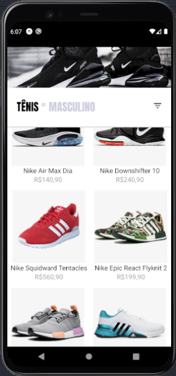
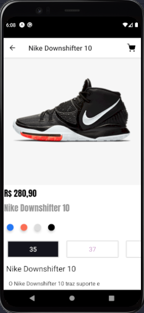
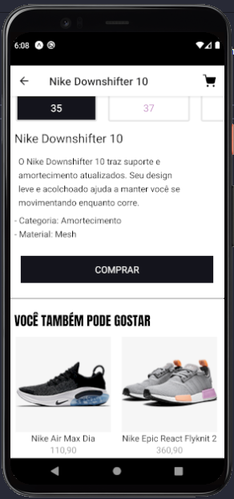

# shop-tenis

Projeto criado para estudo de react, no projeto reproduzi o front-end de uma loja que vende tênis, 
usando icones e react-navigation.

# Resultado: 
### Página de Home: 

### Topo da página de detalhe do produto: 

### Scroll de baixo da página de detalhe do produto: 

